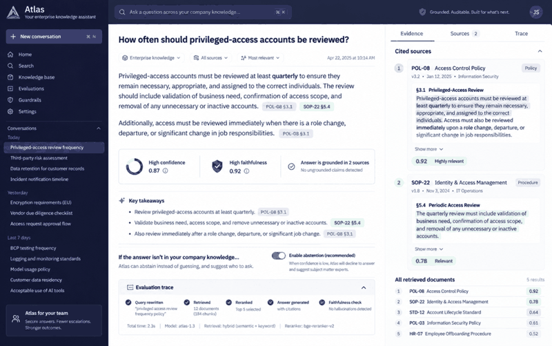

# Atlas — Enterprise RAG Assistant

A grounded internal knowledge assistant with ranked evidence, citations and abstention.



## What this repository demonstrates

- Tokenisation and cosine retrieval
- Evidence threshold and abstention
- Citation-first response contract

## Run locally

```bash
python -m src.app
python -m pytest
```

The interface prototype is available at `docs/dashboard.html`.

## Data and integrity note

All people, companies, cases, metrics and operational records shown here are synthetic demonstration data. This independent portfolio project demonstrates engineering and analytical capability; it does not claim that the system was deployed for an employer or client.

## Engineering practices

- Domain logic separated into testable functions
- Automated tests executed through GitHub Actions
- Reproducible standard-library implementation
- Docker entry point for consistent execution
- Documentation of architecture and assumptions
